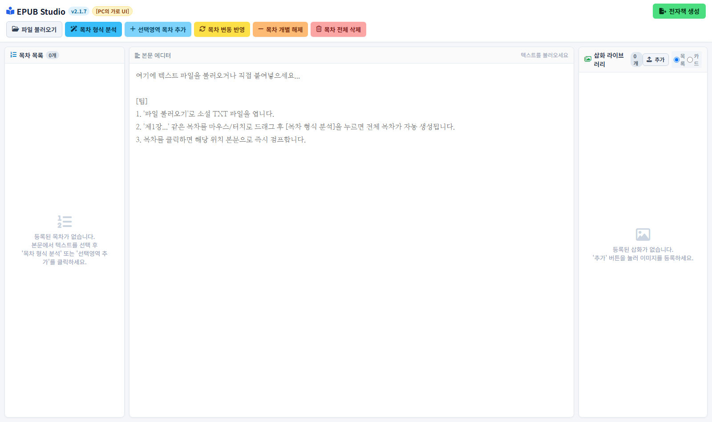
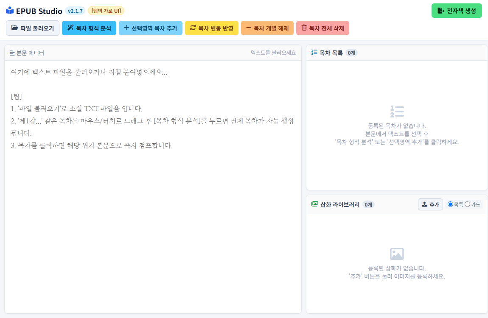

# 📚 EPUB 전자책 제작 스튜디오 (EPUB Studio)
> **OS의 제약 없이 대용량 텍스트 원고를 빠르고 안전하게 국제 표준 EPUB 3/2 전자책으로 변환하는 모던 크로스 플랫폼 웹 스튜디오**

---

## 🌟 프로젝트 소개 (Overview)

**EPUB Studio**는 Python 기반 데스크톱 소프트웨어의 운영체제 종속성과 환경 구축 번거로움을 해결하기 위해 탄생한 **독립형(Stand-alone) PWA 웹 저작 도구**입니다.

문학, 수필, 인문·학술 서적, 비즈니스 보고서, 기술 매뉴얼, 웹소설 등 **모든 형태의 텍스트 기반 출판물**을 스마트폰, 태블릿, PC 어디서나 브라우저만으로 손쉽게 국제 표준 EPUB 전자책으로 저작하고 다운로드할 수 있습니다.

* 🚀 **라이브 데모 (Live Web App):** [https://123494321.github.io/EPUB-creation-web-tool/](https://123494321.github.io/EPUB-creation-web-tool/)
* 📘 **공식 사용자 가이드 (User Guide):** [docs/EPUB_스튜디오_사용자가이드.pdf](./docs/EPUB_스튜디오_사용자가이드.pdf)
* 📕 **공식 기술 백서 (Technical Whitepaper):** [docs/EPUB_스튜디오_기술백서.pdf](./docs/EPUB_스튜디오_기술백서.pdf)

---

## ✨ 핵심 기능 (Key Features)

| 기능 (Feature) | 상세 설명 |
| :--- | :--- |
| ⚡ **22.6MB 무손실 가상 뷰포트** | 수백만 줄 규모의 초대용량 출판 원고도 브라우저 랙 0ms로 쾌속 편집 (Virtual Viewport Windowing) |
| ⚙️ **Web Worker 멀티스레딩** | 100만 줄 목차 패턴 정규식 탐색 및 ZIP 압축을 백그라운드로 처리하여 UI 프리징 0% 실현 |
| 📐 **4-Way 종횡비 반응형 UI** | 픽셀이 아닌 기하학적 **화면비(Aspect-Ratio)**를 통해 스마트폰(20:9), 태블릿(16:10), PC(와이드) 완벽 식별 |
| 💡 **아이디어 A 툴바 혁신** | 상단 3대 핵심 버튼 압축 + 서브 관리 도구 목차 탭 이관으로 모바일 작업 공간 극대화 |
| 📱 **20배 거대 타이탄 터치 스케일** | 스마트폰 세로 모드 전용 20배 대형 캡슐 버튼, 27px+ 대형 활자, 110px 초거대 탭 바 탑재 |
| 🔒 **100% 로컬 제로-서버 보안** | 원고가 외부 서버로 단 1바이트도 전송되지 않고 브라우저 내부에서만 연산 (원고 유출 물리적 0%) |
| 📖 **국제 표준 EPUB 3/2 & 조판 최적화** | IDPF ePubCheck 100% 통과, 들여쓰기 제거(`text-indent: 0;`)로 리디북스 TTS 및 모바일 리더기 최적화 |

---

## 📸 실제 구동 화면 (Screenshots)

### 1. PC 대화면 3단 전문가 스튜디오

### 2. 태블릿 가로 2단 분할 와이드 스튜디오

### 3. 스마트폰 세로 20배 타이탄 스케일 (Galaxy Jump 2 실측)

  
  
  

---

## 📂 프로젝트 문서 안내 (Documentation)

* 📘 **[사용자 가이드 PDF](./docs/EPUB_스튜디오_사용자가이드.pdf)** : 파일 불러오기부터 목차 분석, 삽화 삽입, 최종 출판까지 단계별 조작 매뉴얼
* 📕 **[기술 백서 PDF](./docs/EPUB_스튜디오_기술백서.pdf)** : 시스템 아키텍처, 뷰포트 메모리 기법, 화면비 분기 알고리즘, 성능 벤치마크

---

## 📄 라이선스 (License)

This project is licensed under the MIT License - see the [LICENSE](LICENSE) file for details.
